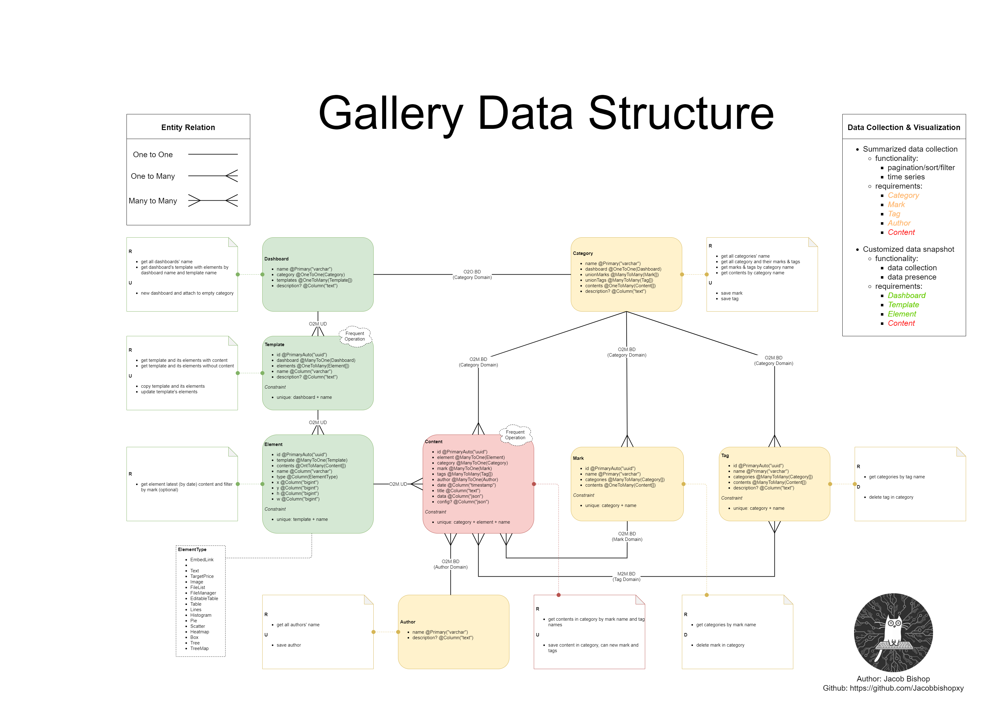

# CYBER BRICK

## Prerequisites

1. [nestjs](https://nestjs.com/) NodeJS framework

2. [typeorm](https://typeorm.io/) database ORM

3. [react](https://reactjs.org/) JavaScript library

4. [ant design pro](https://beta-pro.ant.design/) UI solution

## Environment Prepare

```
npm i
```
or
```
yarn
```

## Configuration Prepare

In `resources` folder:

1. new `config.json` (see [config.template.json](server/resources/config.template.json)). 
If file not supplied, system would automatically read `config.template.json`.

## Start Project

1. development mode: 

    * `yarn serve:dev` for server side then in another terminal `yarn dev` for frontend
    
    * if offline mode (no database connection), please use `yarn serve:dev:offline` & `yarn dev:offline`

2. production:

    * `yarn build` then `yarn serve`

## Route

Check [config/config.ts](config/config.ts) for detail.

## Mark

For some detailed project components.

### Gallery



