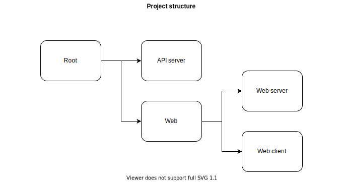

# CYBER BRICK

## Prerequisites

### Server

1. [Flask](https://palletsprojects.com/p/flask/) Web framework

2. [SqlAlchemy](https://www.sqlalchemy.org/) Database ORM

3. [Pandas](https://pandas.pydata.org/) Data Analysis Library

### Web

1. [Typescript](https://www.typescriptlang.org/) Typed JavaScript

2. [NestJS](https://nestjs.com/) NodeJS framework

3. [Typeorm](https://typeorm.io/) Database ORM

4. [React](https://reactjs.org/) JavaScript library

5. [Ant design pro](https://beta-pro.ant.design/) UI solution

## Environment Prepare

### Server

versions:
* Python >= 3.8

commands:
1. `cd server`
2. `pip install -r requirements.txt`

### Web

versions:
* Node >= 12.13
* npm >= 6.12
* yarn >= 1.22

commands:
1. `cd web`
2. `npm i` or `yarn`

## Configuration Prepare

In `resources` folder, new `config.json` (see [config.template.json](resources/config.template.json)). 

### Server

todo

### Web

todo

## Start Project

### Server

Please `cd server` first then do the following commands.

1. development mode:

    * `python wsgi.py`

2. production:

    * `python wsgi.py --env=prod`

3. production (docker):

    todo

### Web

Please `cd web` first then do the following commands.

1. development mode: 

    * `yarn serve:dev` for server side then in another terminal `yarn dev` for frontend
    
2. production:

    * `yarn build` then `yarn serve`
    
3. production (docker):

    * setup node image, only for the first time:
      ```
      cd docker/docker-node
      bash setup.sh
      ```
    
    * setup dependencies installed image, rerun if dependencies updated:
      ```
      cd docker/docker-base-web
      bash setup.sh
      ```
      
    * setup built app image and start a container:
      
      ```
      cd docker/docker-app-web
      bash setupt.sh
      bash start.sh
      ```

    * `yarn build:backend` & `yarn build:frontend` building up web's server & client respectively

## Project Structure



## Detail

### Server

[README](server/README.md)

### Web

[README](web/README.md)
