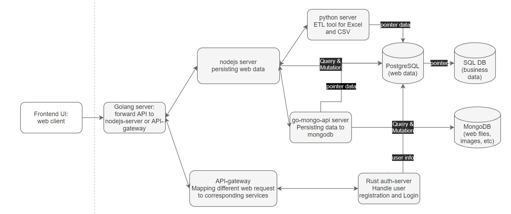

# Cyberbrick

## Why Cyberbrick?

Cyberbrick is a platform for extracting, transforming, storing, and visualizing business data. When analyzing business data from excel, cyberbrick acts as an ETL(Extract, Transform, and Load) tool to persist the data in the database. Then, cyberbrick also provides a dashboard for visualizing business and presenting business information. Some core features of the dashboard include drawing and auto-updating graphs, editing and presenting articles, and a searchable tagged file system.

## Cyberbrick Project Structure

## What Cyberbrick does?

Cyberbrick consists of one frontend web-client and many microservices that maybe written in Rust, Golang, or Nodejs. Microservices are independent from each other, and have their docker file respectively. They may share some env files/variables.

- The web client source code is located in `web`. In production mode, it's served by a golang proxy server located in `web/server`. What the server does is to forward the http request to nodejs server or api-gateway. We are on the process of migrating nodejs to api-gateway. Once we finish migration, all http request should be forwarded to api-gateway.
- The microservices are
  1. `server-nodejs`: the server used to serve web clients. It takes care of almost every API request sent from the web-client. For example, persisting web app user actions' data, storing web app layout information, forwarding file upload/extract to another server, etc
  2. `inn`: SQLite services that persist announcements in web app welcome page.
  3. `server-go`: a golang server that performs query and mutation with MongoDB. Now it's used to persist images, texts, or JSON data generated by the web client. Nodejs server has taken care of the forwarding and retrieving "pointer" data to & from server-go.
     Server-go uses `mux/gorilla` and `go-mongo-driver` as dependencies. It reads a configuration file, connect to MongoDB, and then serves to create, update, upsert, get, and delete documents in MongoDB.
  4. `server-python`: the server used to handle file I/O, mainly Excel and CSV. It uses `pandas` and `sqlAlchemy`. File I/O is the core feature of cyberbrick. Because we doesn't have people to clean and manually load the raw data to database, the only way we could persist the business data is through Excel file extraction.
     However, python doesn't support multi-thread, meaning when server-python is handling a huge file it stops processing other users' requests. Also, `pandas` doesn't support streaming file I/O. When a user uploads a huge Excel file, `pandas` would load all the information from the file to the memory. This could be a disaster. Thus, we are migrating the functionality of server-python to `ubiquitous-data-server` inside the submodule `ubiquitous-alchemy`. We are rewriting the service in Rust so that we have more control over the Excel file I/O.
  5. `ubiquitous-alchemy`: a submodule inside Cyberbrick project. It contains multiple services for the web client such as authentification and api-gateway. All services inside `ubiquitous-alchemy` should be taken care of by the `api-gateway`. Cyberbrick only needs to forward the http request to the `api-gateway` and waits to get the http response back.

## Web Client

In development mode, the web client's API request is handled through [proxy agent](../web/config/proxy.ts). In production environment, web client is served by a [golang server](../web/server/main.go).

Web project structure:

1. `config`: configuration files of the web client, including proxy, routes, themes, etc
2. `server`: golang server that serves the web app in the production environment.
3. `src`: React components that handle user interaction and send API requests

The web client uses scaffold `umi` and a React UI library `antd`.

#### src

src structure is

1. `App.ts`: Runtime configuration module, provide expansibility at runtime. Such as router, render update. Enforce user login when the current cookie has expired. Also, define the error handler.
2. `global.less`: global CSS file
3. `locales`: Multi-language support. Cyberbrick supports Chinese and English.
4. `models`: Dashboard modules redirection. This feature is under construction. It should be a callback redirection for the industry chain preview. When a user clicks an industry/company, it should redirect the user to the corresponding dashboard of such industry/company.
5. `services`: All API requests, as well as request data structure, defined here. Authentification API requests start with path `/gateway` while other API requests start with path `/api`.
6. `pages`: All router entries here.
   1. `demo`: For demo purposes. Only visible in development mode.
   2. `document`: Display user `manual` and project `documentation`.
   3. `gallery`: core feature of the web app, as well as Cyberbrick. It contains four sub-pages: `Configuration`, `Dataset` `Dahsboard`, and `DahsboardTemplate`.
      1. `Welcome`: home page that presents announcements. Users could also edit announcements. The Authority system is under construction. In the future, only the admin has permission to edit announcements.
      2. `Configuration`: Configure database connections and dashboard's three levels of navigation.
      3. `Dataset`: data visualization. The page where users can query tables or upload files to replace/insert tables.
      4. `Dahsboard`: Supports and enforces three levels of navigation. The first level is called `category`, the second level is called `dashboard`, while the third level is called `template`. When all three levels are defined and selected, users could view and update module elements under the `template` page.
      5. `DahsboardTemplate`: a `template library` for the `Dashboard` page. Similar to the structure of `Dahsboard`, it also enforces a three levels navigation. When all three levels are defined and selected, instead of editing the actual content of the module elements, users are supposed to edit templates like the size, type, and position of elements. The style of the elements inside templates library is different from the elements in the `Dahsboard` page. Users could also enter remarks/desciptions for each elements, which indicate what kind of content should the elements have.
   4. `user/login`: user login, registration, and invitation (the page redirect from invitation email) page.
7. `utilities`: miscellaneous helper functions and hooks such as timeStamp string generator.
8. `util`: web development helper functions, such as local storage helper.
9. `components`: React components that handle user interactions. See details in the next section.

#### components

1. Editor: an abstraction of editor control. Define a toggleable button that could be toggled to represent 'edit' or 'done'. Button type could be icons, text, links, etc.
2. TextEditor: Uses `ReactQuill`, it's a rich text editor. In edit mode, the menu bar is visible and users can select items in the menu bar to customize the article style. In presenter mode, articles are read only.
3. Article: the component that defines announcements editor and presenter in the welcome page. In edit mode, a modal with a text editor, date picker, and tag selector will pop up. In presenter mode, the article will be displayed according to the style defined in the text editor along with title, date, and tags.
4. Login: use antd pro form. Define the login and registration form.
5. Gallery: all the components needed in `pages/gallery`. Among them,
   - `Configuration`: the table that displays configuration information in `pages/gallery/configuration`. Also allow users to edit the config data.
   - `Dataset`: the table that displays users' uploaded files' data. Also support users to query or update those data.
   - `Dashboard`: core feature of Cyberbrick. The components where users will interact the most. It has two parts: `Container` and `Controller`.
     `Controller` allows users to navigate to specific tab pages, check the content of that page, and/or edit the content of that page. It also defines the [modal form](../web/src/components/Gallery/Dashboard/DashboardController/AddModuleModal.tsx) where users choose to create new module elements. Users can also import the elements layout defined in other panes or template library. `Controller` also sets the mode of the current page: edit mode or present mode.
     `Container` displays the selected pane. A pane contains multiple elements. Each element has a title, id, date, type, and layout properties. We use `react-grid-layout` to displays elements, so every element is draggable and resizable. Every element also has content. The content is defined in `ModulePanel` (see the section below). `Container` handles elements' properties update and content's update. `Container` also handles the logic to fetch elements information through the API.
   - `ModulePanel`: defines the content of an element. **Note that the 3rd level of the dashboard's navigation is called a pane. A pane has multiple elements. Each element consists of a module panel. A module panel consists of 3 parts. A general panel has a header, a body, and a footer while a template panel has a header, a description, and a body.**
     Module header contains a title and the panel controller (drag handler to change module position, edit button to toggle panel's edit mode and present mode, delete button to delete current module).
     Module body differs with element's type and current mode. The module body is generated by the HOC `ModuleGenerator`. All bodies should have an `editor` and `presentor` with the same editor and presenter props. All the body content is defined in `ModulePanel/Collections`. There are four main types:
     1. `graph`: select data for the graph in editor mode; display graph in presenter mode.
     2. `table`: upload Excel, CSV, or select data from `dataset` in editor mode; display generated table in presenter mode.
     3. `file`: under construction. The file system allows tagging files and searching files through tags.
     4. `miscellaneous`:
        1. `article`: edit article in edit mode; display article in presenter mode.
        2. `image`: under construction. Display images.
        3. `link`: enter link to embed in edit mode; Display the embedded content in presenter mode.
        4. `targetPrice`: enter investment action and target price in edit mode; display target price with themes based on investment action.
        5. `fieldSeparator`: a separator with transparent background. Use to separate elements in the same pane. In edit mode, user can edit the text, font-size, and alignment of the separator's content. In present mode, user can see the text with selected font-size and alignment.
        6. `nestedModule`: a module that has two parts: a header with multiple tabs, and an embedded module. Each tab corresponds to an embedded module. An embedded module can be any type mentioned above, except type `nestedModule`. The header uses `react-grid-layout`, so in edit mode, each tab in the head is draggable and resizable. The content of a tab could be icons, text, or number. In present mode, user could switch the embeded module by clicking different header tabs.
