# 项目描述

## 产品简介

Cyberbrick是一个用于提取、转换、存储和可视化业务数据的平台。

在分析业务数据时，cyberbrick充当ETL(提取、转换和加载)工具，将数据持久化到数据库中。

然后，cyberbrick还提供了一个用于可视化业务和表示业务信息的仪表板和自定义主题。仪表板的一些核心功能包括绘制可随数据变化自动更新的图表、编辑和显示文章，以及可搜索的可标记文件的文件系统。

## 项目架构

## 项目介绍

Cyberbrick由一个web server（前端）和许多微服务（后端）的项目，具有高扩展性、可维护性。微服务之间是相互独立的，各自有自己的docker文件。

### Web server

- Web server负责的是多样式，可自定义、可视化的数据呈现和响应用户的交互。

- 架构图

  

- 数据的范围从大到小的划分：

  1. 行业
  2. 公司
  3. 仪表盘（真正显示的页面，同一个公司可多个仪表板对比）
  4. 维度（利润维度、广告维度等）
  5. 模块（每一个维度的组成单元，表示数据以何种方式可视化（图形、表格等））

- 页面共分为三大部分：

  - welcome：公告
  - 文档：
    - 用户使用手册
    - 服务器文件目录（开发者使用）
    - 数据结构图（开发者使用）
  - 展馆（核心页面）：
    - 配置：按照行业为唯一项呈现所有的行业、公司、仪表盘和对其的增删改查。
    - 仪表盘：按照仪表盘为唯一项呈现所有的仪表盘和所包含的维度；并对其的增删改查。
    - 数据集：仪表盘中的数据来源，根据权限对其增删改查、上传和下载。
    - 模板库：提供创建仪表盘的模板。用户可在其自定义模板，往后一键生成仪表盘。

- 使用流程（例子）

  1. 在配置页面创建行业、公司和仪表盘。
  2. 在仪表盘页面创建维度。
  3. 在维度页面创建模型并选择数据源。

  以上操作只需一次，后续只需更换数据库数据，图表即可发生改变。

  

### 微服务系列

#### 1.User config server（用户设置服务）

该服务负责用户自定义仪表盘和主题的功能，一次设置永久生效。

在开发层面：将每个用户的仪表盘设置和和主题进行持久化存储。

#### 2.Authority server（权限服务）

该服务负责用户的权限划分，根据用户、角色、分组实现了不同用户对页面和数据的权限划分。

在开发层面：对用户的路由表进行动态添加和API的权限执行。

#### 3.Business distribution  server（业务请求分发服务）

该服务负责前端业务请求的分发，实现了前端到后端的业务请求的统一入口。

#### 4.Data server（数据服务）

该服务负责对业务数据的ETL（Extract-Transform-Load）处理。

在开发层面主要完成以下4点：

- 利用Rust语言的 fast, reliable, productive 特性，结合Actix库，使项目达到线程安全和可异步编程。

- 在业务数据和sql数据之间，实现了 sql <——> ADT（代数数据类型）转换。

- 动态连接多个数据库，切换数据库时无需重启服务器并且设置cache服务器，除了第一次和cache服务器中无内容时，其余都通过cache服务器获取数据，I/O更高效。

- 以往的python由于的单线程和第三方ETL工具不支持流式I/O，导致I/O时对内存负担很大和等待时间过长。所以目前通过Rust语言重写一个ETL工具——Fabrix，实现在多种资源间流式加载数据和对数据的计算和转化。

  

- 通过data engine可进行跨库合并数据。

#### 5.Multimedia data server（多媒体数据服务）

该服务负责多媒体数据的处理。

动态连接多个数据库，并有cache和persistence之分，在I/O时做到了快速和安全。

#### 6.File system server （文件系统服务）

该服务负责文件系统的标记和搜索。

#### 7.Topological data server（拓扑型数据服务）

该服务负责产业链、公司关系等拓扑型数据的处理。

